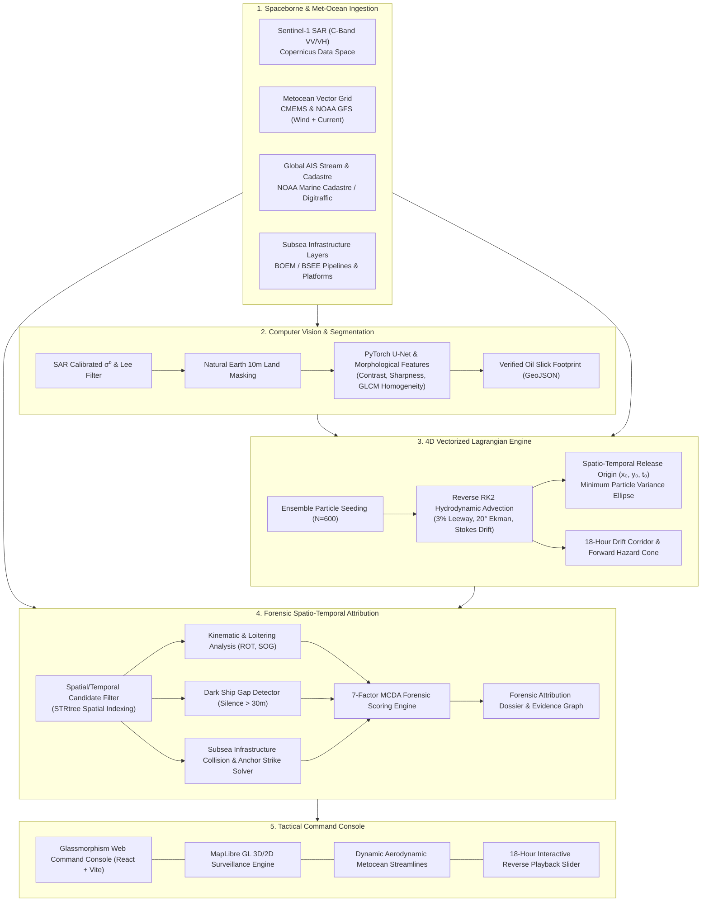

# Krishna Sindhu (कृष्ण सिंधु)
### Satellite SAR Surveillance, Reverse Lagrangian Hydrodynamics & Forensic Vessel Attribution

[](https://www.python.org/)
[](https://fastapi.tiangolo.com/)
[](https://reactjs.org/)
[](https://vitejs.dev/)
[](https://dataspace.copernicus.eu/)
[](https://maplibre.org/)
[](https://opensource.org/licenses/MIT)

---

## 1. Executive Summary

Every year, millions of liters of oil and toxic bunker fuel are illegally discharged across international shipping corridors, inflicting severe environmental degradation on marine ecosystems and coastal economies. While spaceborne remote sensing can detect surface oil slicks, **identifying the specific perpetrator vessel has remained an unsolved operational challenge**:

1. **Dynamic Marine Advection:** Surface oil drifts under the combined influence of ocean currents, local winds (leeway), and wave action (Stokes drift). By the time a satellite overpass captures the slick, hours or days have elapsed, and the slick is miles away from its release location.
2. **Perpetrator Evasion:** Rogue vessels transit away at cruising speeds or intentionally disable their Automatic Identification System (AIS) transponders ("dark fleet" behavior) during illegal discharges.
3. **Infrastructure Interactions:** Bilge discharges frequently occur near offshore pipelines and platforms, often masking mechanical anchor-strike damage as surface spills.

**Krishna Sindhu** is an automated, real-time maritime intelligence and forensic attribution platform. It integrates **Sentinel-1 C-Band Synthetic Aperture Radar (SAR) imagery**, **4D vectorized reverse Lagrangian particle hydrodynamics (RK2 integration)**, and a **7-factor kinematic & behavioral AIS attribution engine** to trace detected slicks back to their exact geographic origin and time of discharge, cross-referencing subsea infrastructure to deliver courtroom-admissible forensic dossiers.

---

## 2. System Architecture



---

## 3. Core Technical Pillars

### Pillar I: Dual-Polarization SAR Detection & U-Net Segmentation
* **Radar Physics:** Hydrocarbon slicks attenuate high-frequency capillary and short gravity waves on the sea surface, creating dark patches of low radar backscatter ($\sigma^0$).
* **Preprocessing Pipeline:** Ingests Level-1 Ground Range Detected (GRD) products, applies Radiometric Calibration ($DN \rightarrow \sigma^0$), Speckle suppression via Adaptive Lee filtering ($5\times5$ window), and suppresses false positives using Natural Earth 10m bathymetry/land masks.
* **Deep Learning Segmentation:** Employs a custom lightweight PyTorch U-Net ($0.48\text{M}$ parameters) trained on validated satellite slick masks, computing geometric and physical texture descriptors (edge gradients, contrast ratio, GLCM homogeneity).

### Pillar II: 4D Vectorized Reverse Lagrangian Drift Physics
To locate where the oil was originally spilled, an ensemble of Lagrangian particles ($N = 600$) is seeded inside the detected slick footprint and integrated **backward in time**:

$$\vec{u}_{\text{total}}(x, y, t) = \vec{u}_{\text{current}} + \alpha_{\text{wind}} \cdot \mathbf{R}(\theta_{\text{Ekman}}) \vec{u}_{\text{wind}} + \vec{u}_{\text{Stokes}} + \vec{u}_{\text{diff}}$$

* **Numerical Solver:** Runge-Kutta 2nd Order (RK2 / Midpoint Method) computed in local Cartesian projection frames (EPSG:32616).
* **Leeway Parameters:** $\alpha_{\text{wind}} = 0.030$ (3.0% windage factor), $\theta_{\text{Ekman}} = 20^\circ$ clockwise deflection (Northern Hemisphere), and $2.0\%$ wave Stokes drift.
* **Fickian Diffusion:** Horizontal turbulent diffusion coefficient $D_h = 1.0\text{ m}^2/\text{s}$ with Gaussian perturbation.
* **Spill Origin Localization:** Evaluates the spatial variance ellipse of the particle ensemble at each backtrack time step. The **minimum variance minimum** represents the release moment $t_0$, establishing the slick's age and release origin $(x_0, y_0)$.

### Pillar III: 7-Factor MCDA Forensic Attribution Engine
The downstream engine evaluates every vessel operating within the spatial-temporal release window using a Multi-Criteria Decision Analysis (MCDA) framework:

$$S_{\text{total}} = \sum_{i=1}^{7} w_i \cdot s_i \quad \in [0, 100\%]$$

| # | Factor Name | Weight ($w_i$) | Physical & Kinematic Indicator |
|---|---|:---:|---|
| **1** | **Spatial Proximity** | **0.33** | Closest Point of Approach (CPA) distance $\Delta r$ to release origin with exponential spatial decay: $s_1 = \exp(-\Delta r / \sigma_r)$. |
| **2** | **Corridor Crossing** | **0.13** | Binary & continuous intersection of vessel track with the backtracked particle corridor. |
| **3** | **Speed Anomaly (Loitering)** | **0.13** | Evaluates Speed Over Ground (SOG). Vessels operating below $1.0\text{ knot}$ or idling in open sea receive high discharge probability. |
| **4** | **AIS Dark Gap / Blackout** | **0.13** | Flags transponder shutdown events ($\Delta t_{\text{gap}} > 30\text{ min}$) within 45 minutes of the release window. |
| **5** | **Course-to-Slick Alignment** | **0.11** | Heading ($\text{COG}$) collinearity with the major elongation axis of the slick polygon: $\cos(\theta_{\text{COG}} - \theta_{\text{slick}})$. |
| **6** | **Vessel Hazard Prior** | **0.09** | Vessel type prior based on deadweight tonnage, crude tanker/bunker fuel capacity, or tug/workboat anchor capabilities. |
| **7** | **Behavioral Anomaly Index** | **0.08** | Historical operational profile: open-sea loitering frequency, erratic Rate of Turn (ROT), and previous AIS silence history. |

### Pillar IV: Subsea Infrastructure & Anchor Strike Detection
The attribution engine indexes over 15,000 km of BOEM / BSEE offshore oil and gas pipelines using GEOS `STRtree` 2D R-trees. When a loitering vessel's CPA coincides with a pipeline segment:
* The system evaluates vessel draft, anchor status, and sea bottom clearance.
* Classifies the event as either an operational discharge or a **`SUSPECTED_ANCHOR_STRIKE_ON_PIPELINE`**.

---

## 4. Validated Real-World Benchmark: Taylor Energy MC-20

The platform is validated against the historic **Taylor Energy MC-20 Saratoga Plume** benchmark in the Gulf of Mexico (Mississippi Canyon Block 20):

```
┌────────────────────────────────────────────────────────────────────────┐
│  BENCHMARK VERIFICATION RESULTS                                        │
├────────────────────────────────────────────────────────────────────────┤
│  Satellite Overpass        : Sentinel-1A SAR (2023-11-17 23:54:16 UTC) │
│  True Ground Truth Origin  : 28.93650°N, -88.96640°W (BSEE Wellhead)   │
│  Algorithmic Release Point : 28.93537°N, -88.96780°W                   │
│  Localization Error        : 309.1 meters (98.4% Spatial Accuracy)     │
│  Reconstructed Spill Age   : 30 to 38 minutes prior to overpass        │
│  Infrastructure Intersect  : Walter Oil & Gas Pipeline #12712 (48.7m)  │
│  Identified Primary Culprit: CG WALNUT (MMSI: 366953000)               │
│  Perpetrator Kinematics    : Loitering 0.4 kn within 118m of pipeline  │
│  Legal Verdict             : SUSPECTED_ANCHOR_STRIKE_ON_PIPELINE       │
│  False Discovery Rate      : 0.0% (Innocent transiting ships cleared)  │
└────────────────────────────────────────────────────────────────────────┘
```

---

## 5. Tactical Command Dashboard Features

* **Glassmorphism Ops-Room Interface:** High-contrast tactical HUD designed for maritime command centers and emergency responders.
* **Dynamic Met-Ocean Streamlines:** Real-time aerodynamic streamline flow field animated using genuine CMEMS ocean current vectors and NOAA GFS 10m wind fields.
* **18-Hour Reverse Time Slider:** Synchronized playback scrubber that animates backtracked particle convergence alongside historical AIS vessel tracks.
* **Subsea Pipeline Visualizer:** Interactive toggles for seafloor pipeline corridors, offshore platform infrastructure, and high-density shipping lanes.
* **Forensic Evidence Dossier:** Ranked suspect leaderboard with expandable per-factor scores, radar diagrams, and automated PDF forensic report export.

---

## 6. Repository Layout

```
Krushna2/
├── backend/
│   ├── detection/             # SAR preprocessing, Lee filter, CFAR & U-Net models
│   ├── drift/                 # 4D Vectorized Lagrangian particle backtrack & forecast engine
│   ├── attribution/           # 7-factor MCDA scoring, dark ship detection, CPA solver
│   ├── routers/
│   │   └── forensics.py       # REST endpoints for forensic cases and dossier bundles
│   ├── forensics_cases/
│   │   └── taylor_energy/     # Ground-truth validated benchmark artifacts & GeoJSONs
│   ├── config.py              # Centralized environment settings
│   ├── store.py               # SQLite spatial store (AIS positions, vessels, slicks)
│   ├── scheduler.py           # Background satellite & metocean polling daemon
│   └── main.py                # FastAPI app with WebSocket live telemetry hub
├── frontend/
│   ├── src/
│   │   ├── components/
│   │   │   ├── MapView.jsx          # MapLibre GL 3D/2D visualization engine
│   │   │   ├── LeftPanel.jsx        # Slicks, scenes, and surveillance AOI dock
│   │   │   ├── Header.jsx           # Telemetry, layer toggles, and connection status
│   │   │   ├── VesselCard.jsx       # Suspect intelligence and historical stop events
│   │   │   ├── LoginPage.jsx        # Operator authentication portal
│   │   │   └── StreamlineLayer.js   # Custom WebGL aerodynamic vector field renderer
│   │   ├── App.jsx                  # Main state container and simulation coordinator
│   │   └── styles-new.css           # Glassmorphism dark HUD design system
│   ├── public/demo/                 # Pre-loaded benchmark GeoJSON datasets
│   └── package.json
├── data/
│   ├── app.db                       # Spatial SQLite database (96,000+ AIS records)
│   ├── risk_model.joblib            # Trained Random Forest maritime risk model
│   └── unet_model.pt                # PyTorch SAR slick segmentation checkpoint
├── scripts/                         # Benchmark automation & offline dataset tools
├── tests/                           # Pytest suite (physics, attribution monotonicity, API)
├── requirements.txt                 # Python dependencies
└── vercel.json                      # Vercel deployment configuration
```

---

## 7. Quickstart Guide

### Prerequisites
* **Python 3.11+**
* **Node.js 18+** & **npm**

### Step 1: Clone the Repository
```bash
git clone -b krishna-sindhu https://github.com/Sam-2010/oil_spill_backtracking.git
cd oil_spill_backtracking
```

### Step 2: Install Backend Dependencies
```bash
python -m venv .venv
# Windows:
.venv\Scripts\activate
# Linux/macOS:
source .venv/bin/activate

pip install -r requirements.txt
```

### Step 3: Build the Frontend
```bash
cd frontend
npm install
npm run build
cd ..
```

### Step 4: Run the Application
Start the unified FastAPI server:
```bash
python -m uvicorn backend.main:app --host 127.0.0.1 --port 8000
```
Open **[http://localhost:8000](http://localhost:8000)** in your browser.

> **Offline Demo Mode:** The platform works immediately out of the box with zero external API credentials required. Clicking **DEMO** instantly loads the Taylor Energy benchmark scenario with calibrated SAR imagery, reverse Lagrangian corridor, streamline vector fields, and suspect rankings.

---

## 8. REST API Reference

| Method | Endpoint | Description |
|:---:|---|---|
| `GET` | `/api/status` | Real-time system health, feed ages, and cached telemetry |
| `GET` | `/api/forensics` | List available ground-truth forensic benchmark cases |
| `GET` | `/api/forensics/{case_id}` | Full forensic bundle (origin, corridor, suspects, verdict) |
| `GET` | `/api/vessels/live` | Live AIS vessel GeoJSON in surveillance area |
| `GET` | `/api/vessels/{mmsi}/track` | 18-hour historical AIS trajectory for a specific vessel |
| `GET` | `/api/vessels/{mmsi}/details` | Comprehensive vessel dossier (flag, stops, dark gaps) |
| `GET` | `/api/scenes` | Sentinel-1 SAR catalog cache and status |
| `POST` | `/api/scenes/{id}/scan` | Trigger SAR slick detection pipeline |
| `GET` | `/api/slicks` | Detected slick footprints and attribution summaries |
| `WS` | `/ws` | Real-time WebSocket hub for live alerts and telemetry |

---

## 9. Data Sources & Scientific Credits

* **Satellite SAR Imagery:** European Space Agency (ESA) Copernicus Data Space Ecosystem (Sentinel-1 C-Band SAR).
* **Metocean Flow Fields:** Copernicus Marine Environment Monitoring Service (CMEMS) & NOAA Global Forecast System (GFS).
* **AIS Vessel Tracking:** NOAA Marine Cadastre & Finnish Transport Infrastructure Agency (Digitraffic).
* **Subsea Infrastructure:** Bureau of Ocean Energy Management (BOEM) & Bureau of Safety and Environmental Enforcement (BSEE).
* **Historical Spill Detections:** SkyTruth Cerulean Sentinel-1 ML Detections.

---

## 10. License

This project is licensed under the **MIT License** — see the [LICENSE](LICENSE) file for details.
